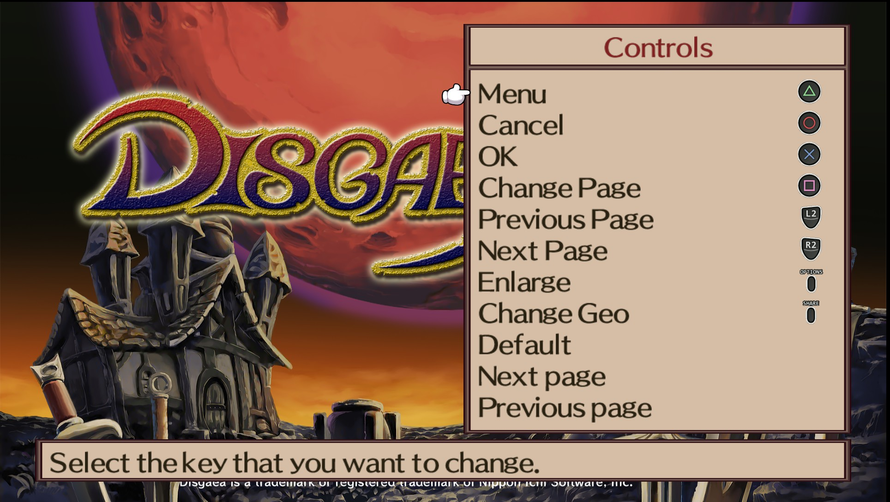

***How to install:***
- Verify integrity of your game files.
- Make sure you're not on beta channel.
- Get this patch in xdelta format [DISGAEA2_PC_DS_BUTTON_PROMPTS.xdelta](DISGAEA2_PC_DS_BUTTON_PROMPTS.xdelta)
- Get XDelta patcher (I've used the UI version from here https://www.romhacking.net/utilities/598/).
- Patch the SUB_DATA.DAT file inside your Disgaea2 PC install folder ("Steam\steamapps\common\Disgaea 2 PC" for me)
- Replace the original file with the patched one
- GL, HF

  

  ***Icons:***
- Icons were taken from here: https://opengameart.org/content/free-controller-prompts-xbox-playstation-switch-pc1.

